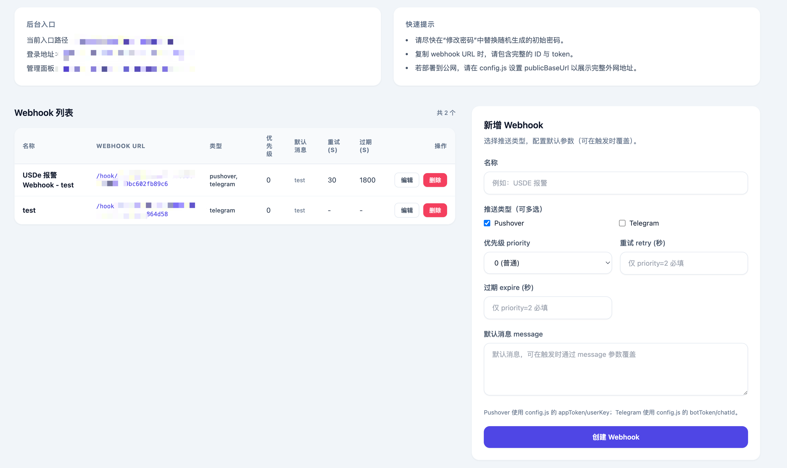

# Push Webhook Server (Pushover)

## 功能概述



- 管理 UI：登录后可添加/删除 webhook。
- 支持 Pushover 与 Telegram 两种推送（逐条 Webhook 可多选通道）。
- 管理员可在“修改密码”页更新密码（哈希存储于 data/admin.json）。
- 对于 Pushover，可配置 priority、message、retry、expire（默认 priority=2）；对于 Telegram，仅需消息内容。
- 提供触发 URL，调用后向所选通道发送通知。
- 首次启动时自动生成后台入口路径和随机管理员账号密码（可自定义/修改）。
- 端口、管理员账号、后台路径、Pushover appToken/userKey 等通过 config.js 配置。
- 后台界面使用 Tailwind UI 风格，支持桌面与移动端访问。
  
## 快速开始
1. 安装依赖：`npm install`
2. 配置推送：编辑 `config.js`，按需填写以下任意一项或两项：
   - `pushover.appToken` 和 `pushover.userKey`
   - `telegram.botToken` 和 `telegram.chatId`
3. 启动服务：`npm start`
   - 默认运行在 `http://localhost:3000`（可通过环境变量 `PORT` 指定；设为 `0` 则自动选择端口）。
   - 首次启动会在日志中输出：
     - Admin username / password（若未在 `config.js` 自定义，将随机生成）
     - Admin login URL / Admin panel URL（带随机生成的路径片段）
   - 这些信息同时会写入 `data/admin.json`（凭据哈希）与 `data/server-meta.json`（后台路径）。

### 环境确认
2. 安装 Node.js ≥ 18 与 npm（可通过 NodeSource 或 nvm 获取最新 LTS 版本）。
3. 确认证书与网络可访问 `api.pushover.net`。
4. 确认证书与网络可访问 `api.telegram.org`。

### 同步与配置
1. `git clone https://github.com/summertian4/push-webhook-sever.git`
2. `cd push-webhook-sever && npm install`
3. `cp config_example.js config.js`，修改以下内容：
   - `sessionSecret`：随机生成新的密钥。
   - `admin`：可留默认让系统随机生成，也可自定义初始账号密码与后台路径。
   - `pushover`：如需 Pushover，填入 `appToken` 与 `userKey`。
   - `telegram`：如需 Telegram，填入 `botToken` 与 `chatId`。
   - 如需固定端口，启动时设置 `PORT=3000` 等环境变量；部署公网请填写 `publicBaseUrl`。

### 登录与管理
1. 登录入口：使用启动日志中的 Admin login URL 访问。
2. 登录凭据：使用日志中的账号密码（或 `config.js` 中自定义的账号密码）。
3. 修改密码：登录后通过导航中的“修改密码”链接进入（路径位于随机入口下，例如 `/随机路径/admin/password`）。首次修改会更新 `data/admin.json`。
4. 新增 webhook：在“管理面板”列表页填写名称、选择推送类型（可多选），Pushover 可设置 priority/retry/expire，保存后会生成触发 URL（`/hook/:id/:token`）。
5. 编辑 webhook：在列表中点击“编辑”可更新名称、推送类型与默认参数。
6. 触发通知：对生成的 URL 发起 POST 或 GET 请求即可向相应通道推送，可通过 body 或 query 覆盖默认消息：
   ```bash
   curl -X POST "http://localhost:3000/hook/ID/TOKEN" \
     -H "Content-Type: application/json" \
     -d '{"message":"🚨 USDE 价格报警，注意杠杆","priority":2,"retry":30,"expire":1800}'
   ```

## 参数说明
- priority：-2, -1, 0, 1, 2，若为 2（紧急），retry 与 expire 必填。
- message：默认使用在 UI 中配置的 message，也可在触发时覆盖。
- retry：单位秒，仅 priority=2 需要，最小 30。
- expire：单位秒，仅 priority=2 需要。

### Telegram 额外说明
- 在“新增 Webhook”中勾选 Telegram 即可（可与 Pushover 同时勾选）。
- 全局使用 `config.js` 的 `telegram.botToken` 与 `telegram.chatId`；也可在触发时通过 `chatId`/`chat_id` 覆盖。
- 示例（Telegram）：
  ```bash
  curl -X POST "http://localhost:3000/hook/ID/TOKEN" \
    -H "Content-Type: application/json" \
    -d '{"message":"Hello from Telegram"}'
  ```

## 配置文件（config.js）
- sessionSecret：会话密钥（请修改）
- admin：管理员账号密码以及可选 basePath（留空，则首次启动自动生成随机路径和账号密码）
- pushover：全局 appToken 与 userKey（可选）
- telegram：全局 botToken 与 chatId（可选）
- dataFile：webhook 数据存储文件路径
- publicBaseUrl：用于 UI 展示完整 webhook URL（例如 https://your.domain）。留空则只显示路径。

## 运行时数据
- data/admin.json：当前管理员用户名 + 加密后的密码。
- data/server-meta.json：后台入口路径等信息。
- data/webhooks.json：保存的 webhook 列表。

## Pushover API 示例
```bash
curl -X POST https://api.pushover.net/1/messages.json \
  -d "token=YOUR_TOKEN" \
  -d "user=YOUR_USER" \
  -d "message=🚨 USDE 价格报警，注意杠杆" \
  -d "priority=2" \
  -d "retry=30" \
  -d "expire=1800"
```


## 安全建议
- 使用 priority=2 时务必提供 retry 与 expire。
- 在生产环境配置 publicBaseUrl 以便复制完整 URL。
